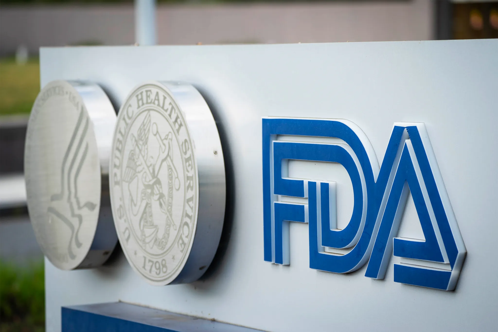
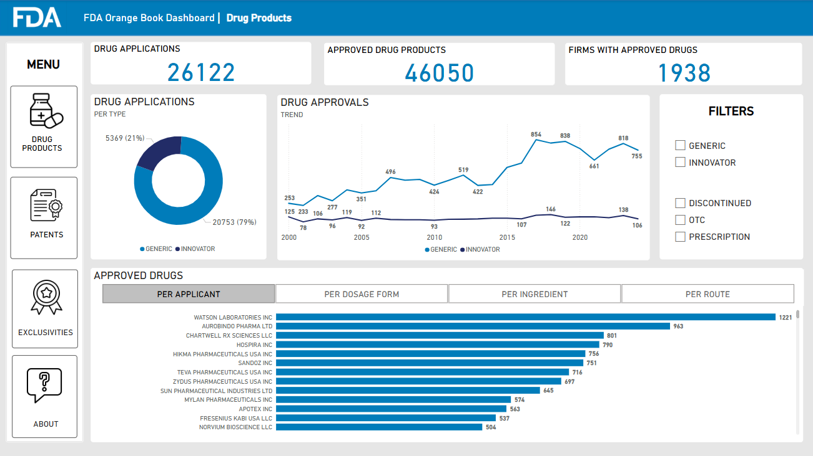
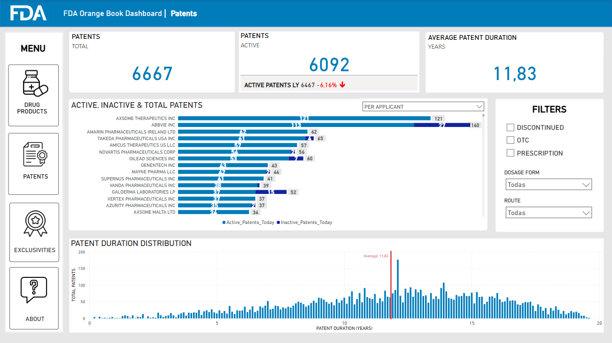
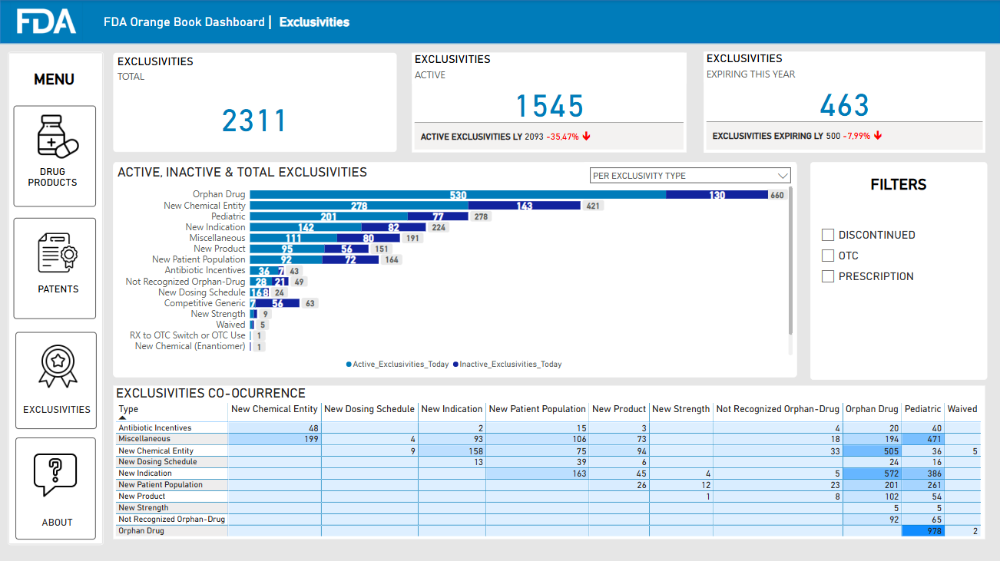
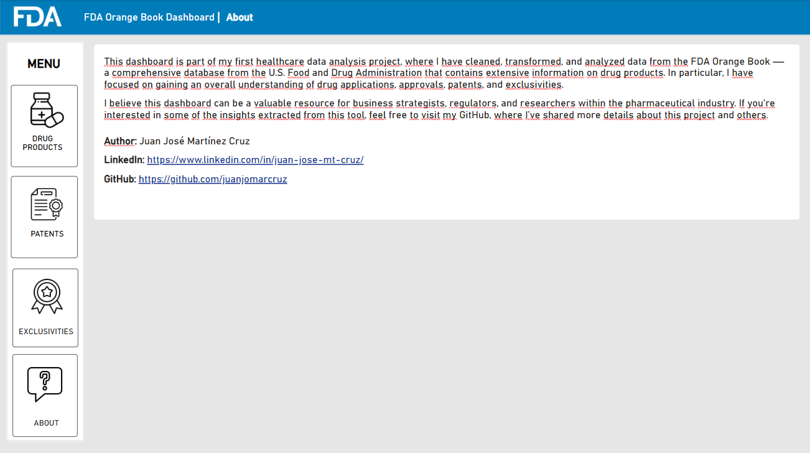

# Healthcare Data Analysis Project: Patents & Exclusivities



## Description

In this Healthcare Data Analysis Project, I've analyzed a dataset from the **FDA Orange Book**, a database published by the U.S. Food and Drug Administration (FDA) which provides information on FDA-approved drug products, therapeutic equivalences between innovators & generic drugs, patents & market exclusivities.

The analysis has focused on gaining insights on **Patents and Exclusivities**: Which has been the patent submission trend over the last years? Which are the firms holding the highest number of patents? Which exclusivities are typically granted together?

Addresing these kind of questions is crucial to have a more deep understading of current drug competition in the US market and regulatory incentives granted by the FDA to foster drug development and accessibility.

## Objective

To deliver a **powerful tracking tool** for assisting business strategists, regulators & market researchers in monitoring **FDA drug approvals**, **drug competition within the US market** and **FDA-granted incentives** in the pharmaceutical industry.

## Structure

```bash
FDA_Orange_Book_Project/
├── 0_Images/ #contains the images used for the project's README and dashboard.
│   ├── dashboard_1.png
│   ├── dashboard_2.png
│   ├── dashboard_3.png
│   ├── dashboard_4.png
│   ├── drug_products.png
│   ├── FDA_logo.png
│   ├── FDA_sign.png
│   ├── help.png
│   └── patent.png
│
├── 1_Data/
│   └── Data_Raw/ #includes only the raw data, without transformations or cleanage.
│   │   ├── exclusivity_raw.txt
│   │   ├── patent_raw.txt
│   │   ├── patent_use_codes_raw.xlsx
│   │   └── products_raw.txt
│   │
│   └── Data_Transformed/ #includes data cleaning and transformations.
│   │   ├── exclusivity_tr.xlsx
│   │   ├── patent_tr.xlsx
│   │   └── products_tr.xlsx
│   │
│   └── Metadata/ #includes additional info on data to give context.
│      ├── Column_Definitions.docx #column definitions for each table (products, patents and exclusivities) together with pre-analysis notes on columns.
│      ├── Exclusivities_Explanation.docx #explanations on how exclusivities can complement patents.
│      ├── FDA_Issue_Patents_Exclusivities.pdf #FDA document on Patents & Exclusivities.
│      └── FDA_PPT_Exclusivities.pdf #FDA PowerPoint with more explanations and examples on Exclusivity types.
│
├── 2_Jupyter_Notebooks/
│   └── 2_1_Data_Processing/ #includes data cleaning & transformation of each table using python data processing libraries: numpy & pandas.
│   │   ├── pre_analysis_cleaning_transformation_ex.ipynb
│   │   ├── pre_analysis_cleaning_transformation_pat.ipynb
│   │   └── pre_analysis_cleaning_transformation_prod.ipynb
│   │
│   └── 2_2_Exploratory_Data_Analysis/ #includes exploratory data analysis of each table using python visualization libraries: matplotlib & seaborn.
│       ├── EDA_ex.ipynb
│       ├── EDA_pat.ipynbb
│       └── EDA_prod.ipynb
│
├── 3_Project_Notes/ #includes my personal notes with my initial planning, captured insights and dashboard design drafts.
│   ├── 3_1_Project_Planning.docx
│   ├── 3_2_Pre_Analysis_Clean_Transf_EDA_Notes.docx
│   └── 3_3_Dashboard_Design_Notes.docx
│
├── Dashboard_FDA.pbix #the project's deliverable.
└── README.md
```

## Dataset Columns

### Table 1: Products.txt

**1. Ingredient (string)**: The active ingredient(s) for the product. Multiple ingredients are listed in alphabetical order, separated by a semicolon.

**2. Dosage form; Route of Administration (string)**: The product dosage form and route, separated by a semicolon.

**3. Trade Name (string)**: The trade name of the product as shown on the labeling.

**4. Applicant (string)**: The firm name holding legal responsibility for the new drug application. Condensed to a maximum twenty-character unique string.

**5. Strength (string)**: The potency of the active ingredient. May repeat for multiple part products.

**6. New Drug Application Type (string)**: Type of drug application. "N" for innovator (NDA) and "A" for generic (ANDA).

**7. New Drug Application (NDA) Number (string)**: The FDA-assigned number to the application. Format is nnnnnn.

**8. Product Number (string)**: The FDA-assigned number to identify the application products. Each strength is a separate product. Format is nnn.

**9. Therapeutic Equivalence (TE) Code (string)**: Indicates the therapeutic equivalence rating of generic to innovator prescription products.

**10. Approval Date (date)**: The date the product was approved, in the format "Mmm dd, yyyy".

**11. Reference Listed Drug (RLD) (string)**: Indicates whether the product is an RLD, approved under section 505(c) of the FD&C Act.

**12. Reference Standard (RS) (string)**: Indicates whether the product is a reference standard used in bioequivalence studies.

**13. Type (string)**: Indicates the category of approved drugs. Format: RX (prescription), OTC (over-the-counter), DISCN (discontinued).

**14. Applicant Full Name (string)**: Full name of the firm holding legal responsibility for the application.

### Table 2: Patent.txt

**1. New Drug Application Type (string)**: Type of drug application. "N" for innovator (NDA) and "A" for generic (ANDA).

**2. New Drug Application (NDA) Number (string)**: The FDA-assigned number to the application. Format is nnnnnn.

**3. Product Number (string)**: The FDA-assigned number to identify the application products. Format is nnn.

**4. Patent Number (string)**: Patent numbers submitted by the applicant. Format is numeric.

**5. Patent Expire Date (date)**: The date the patent expires. Format is "MMM DD, YYYY".

**6. Drug Substance Flag (string)**: Indicates whether the patent claims the drug substance. Format is "Y" or null.

**7. Drug Product Flag (string)**: Indicates whether the patent claims the drug product. Format is "Y" or null.

**8. Patent Use Code (string)**: Code to designate a use patent for the approved indication or use of the drug product.

**9. Patent Delist Request Flag (string)**: Indicates whether the sponsor has requested the patent to be delisted. Format is "Y" or null.

**10. Patent Submission Date (date)**: Date the FDA received patent information. Format is "Mmm d, yyyy".

### Table 3: Exclusivity.txt

**1. New Drug Application Type (string)**: Type of drug application. "N" for innovator (NDA) and "A" for generic (ANDA).

**2. New Drug Application (NDA) Number (string)**: The FDA-assigned number to the application. Format is nnnnnn.

**3. Product Number (string)**: The FDA-assigned number to identify the application products. Format is nnn.

**4. Exclusivity Code (string)**: Code indicating the type of exclusivity granted by the FDA.

**5. Exclusivity Date (date)**: The date the exclusivity expires. Format is "MMM DD, YYYY".

## Which steps did I follow?

### 1. Pre-Analysis

In order to come up with insightful questions to answer when analysing the dataset it was crucial to understand all data fields. For that reason, I first revised the metadata provided by the FDA where I made some notes and pointed out interesting questions to answer.

### 2. Data Cleaning and Transformation

The next step was to dive into the dataset. To explore the dataset I opted to use pandas, a python library very useful for data manipulation. Some of the cleaning and transformations I applied:

- Column names standarization.
- Data types correction.
- Duplicates removal.
- Filling null values.
- Creation of conditional columns to label data.
- Columns splitting.
- Mapping column values (Patent Use Codes, Exclusivity Codes) with dictionary values (Definitions).
- Turning column values into more comprehensive ones with string manipulation functions.

### 3. Exploratory Data Analysis (EDA):

Once I had cleaned and transformed the dataset, I performed univariate and multivariate analysis on numerical, categorical and date columns. For this aim, I chose the most popular data visualization libraries in python: matplotlib and seaborn. While I was performing this task, I gathered the extracted insights in the Word file 3_2_Pre_Analysis_Clean_Transf_EDA_Notes.docx .

### 4. Interactive Dashboard:

Finally, I successfully developed an interactive dashboard that presents key performance indicators and clear, insightful visualizations, offering an at-a-glance view of critical data. As the final deliverable of the project, the dashboard enables business strategists, regulators, and market researchers to quickly identify trends in FDA drug product applications, generic drug competition in the US market, and FDA exclusivity grants. This powerful monitoring tool equips pharmaceutical stakeholders to take the temperature of the US market, understand its dynamics, and orient or refine their strategies.

## Main Insights

**1.**

## Author

- Juanjo Martínez Cruz [LinkedIn](https://www.linkedin.com/in/juan-jose-mt-cruz)

## Contributions

Do not hesitate to contact me if you want to contribute to this project. I will be glad to open any discussion on my [LinkedIn](https://www.linkedin.com/in/juan-jose-mt-cruz) profile.

## The Project's Deliverable








